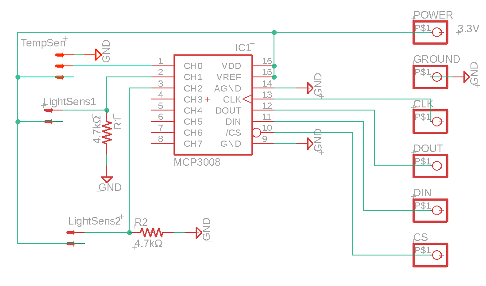
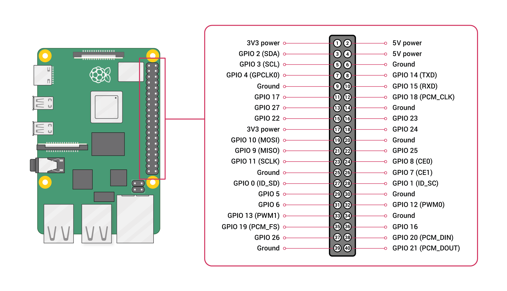

# ThanatoFenestra Altar

## Description
### Introduction
At the start of our summer research program, we were presented with the opportunity to learn through replication by
fabricating a project at the crossroads of Memory Studies and HCI.
We settled on ThanatoFenestra, a “photographic family altar designed with the purpose of supporting a ritual to pray
for the deceased',' originally designed by Daisuke Uriu and Naohito Okude in 2009.
We chose this project to understand how design technologies convey family practices.
The aim of our project was to replicate the ThanatoFenestra concept to use in 
future human-computer interaction research on the social perception of memory technologies.
In this paper, we will detail the design process and technical implementation of ThanatoFenestra’s reconstruction,
including the challenges we encountered and modifications needed to make a fully working design.

### Background and Replication Objective
ThanatoFenestra is a Japanese Buddhist altar reimagined into a circular frame
which displays a projected image that is manipulated by a candle flame.
The concept addresses space challenges of urban living by miniaturizing a traditional Butsudan altar.
Zen Buddhist ideals inspired the circular shape of the structure,
which understands the circle as a window into the afterlife.
A circular wooden frame with Japanese paper is attached to the rear that acts as the projector screen.
From the front, a wooden shelf is nestled below the frame's center.
The shelf’s purpose is two-fold:
it suspends the incense bowl above a tea candle and it hides the sensors that will read the candle flame’s condition.
The original concept used a PC laptop, projector, and a custom microcontroller hidden outside the frame.
Our goal was to recreate the design with open-source and off-the-shelf components,
and fully enclose all electronics for a single portable artifact. 

### Developed by:
- [Ndizeye Tschesquis](https://github.com/cheskynd) - `Berea College`
- [Blade E. Hicks](https://github.com/BladeHicks) - `Berea College`
- [Nancy Landeros](https://github.com/nancylanderos) - `Berea College`

### Libraries:
- OpenCV
- numpy
- Pillow 
- gpiozero 
- screeninfo 
- future
- Click [Here](requirements.txt) to view requirements file 

## Electronic Components

| Component                                      | Quantity |
|------------------------------------------------|----------|
| Raspberry Pi                                   | 1        |
| (TMP36) Temperature Sensor                     | 1        |
| CdS Photoresistor                              | 2        |
| MCP3008 (Digital to Analog Convertor)          | 1        |
| Breadboard or PCB                              | 1        |
| 4.7kΩ Resistor                                 | 2        |
| Miroir M75 Portable Projector (Pico Projector) | 1        |

## Circuit and Schematic
This is the Schematic for the sensor connections to the MCP3008 chip

This is the pinout of the Raspberry Pi 3B+

Source: [Sparkfun](https://learn.sparkfun.com/tutorials/introduction-to-the-raspberry-pi-gpio-and-physical-computing/gpio-pins-overview)

Make the Following connections between the MCP3008 and Raspberry Pi
- MCP3008 CLK to Raspberry Pi SCLK (gpio 11)
- MCP3008 DOUT to Raspberry Pi MISO (gpio 9)
- MCP3008 DIN to Raspberry Pi MOSI (gpio 10)
- MCP3008 CS to Raspberry Pi CEO (gpio 8)
- MCP3008 VDD to Raspberry Pi 3.3V
- MCP3008 VREF to Raspberry Pi 3.3V
- MCP3008 AGND to Raspberry Pi GND
- MCP3008 DGND to Raspberry Pi GND

**For a step-by-step Circuit Tutorial click** [Here](https://docs.google.com/presentation/d/19ZnFAh5yts9XgJ08IMe_UG5gRqYu8efAYSAV-OgQSvA/edit?usp=sharing)

**For a Jupyter Notebook Guide of the program click** [Here](ThanatoFenestra.ipynb)